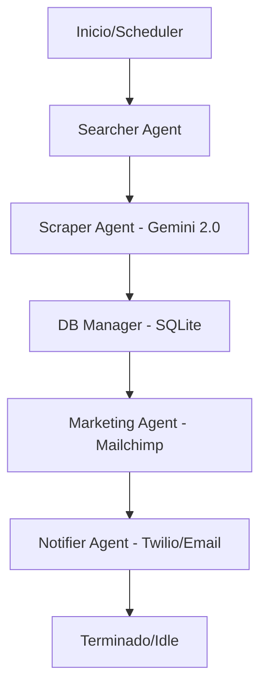

# Análisis Técnico: Sistema Multi-Agente de Prospección de Eventos

Este proyecto es una plataforma automatizada diseñada para descubrir eventos y extraer clientes potenciales (leads) utilizando inteligencia artificial avanzada y flujos de trabajo orquestados.

## Arquitectura del Sistema

El núcleo del sistema está construido sobre **LangGraph**, que orquestra un flujo de trabajo cíclico (pipeline) compuesto por varios agentes especializados.

### 1. El Pipeline de Agentes (`graph.py`)
El flujo sigue una secuencia lógica de 5 etapas:
- **Searcher (Buscador)**: Utiliza **Tavily Search** para encontrar eventos relevantes en la web basados en nichos configurados (ej. Circos, Festivales, Ferias). Es "Time-Aware", lo que significa que prioriza eventos futuros.
- **Scraper (Extractor)**: Navega por las URLs encontradas. Utiliza **Gemini 2.0 Flash** para analizar el contenido de la página y extraer estructuradamente:
    - Nombres de contacto.
    - Correos electrónicos y teléfonos.
    - Fechas del evento (descartando eventos que ya pasaron).
- **DB Manager**: Valida y guarda los leads en una base de datos **SQLite**, asegurando que no haya duplicados.
- **Marketing**: Integra los nuevos leads directamente con **Mailchimp**, suscribiéndolos a una lista de audiencia para campañas automáticas.
- **Notifier**: Envía alertas de éxito a los administradores a través de **WhatsApp (Twilio)** o **Correo electrónico (SMTP)**.

### 2. Tecnologías Clave
- **IA**: Google Gemini 2.0 Flash para la extracción de datos no estructurados.
- **Orquestación**: LangGraph para el control del estado y la lógica de los agentes.
- **Búsqueda**: Tavily API para búsquedas web optimizadas para IA.
- **Interfaz**: **Gradio** proporciona un tablero de control web (http://localhost:7860) para monitorear el progreso y activar búsquedas manuales.
- **Automatización**: **APScheduler** ejecuta todo el proceso automáticamente cada 6 horas.

## Flujo de Datos

## Características Destacadas
- **Filtrado Inteligente de Fechas**: El sistema reconoce si un evento ya ocurrió y descarta el lead automáticamente para evitar spam irrelevante.
- **Persistencia**: Los datos se guardan localmente en `leads.db`, lo que permite llevar un historial de capturas.
- **Extensibilidad**: Gracias al patrón de repositorio y al uso de `uv`, es fácil añadir nuevos nichos de búsqueda o cambiar el motor de base de datos.
