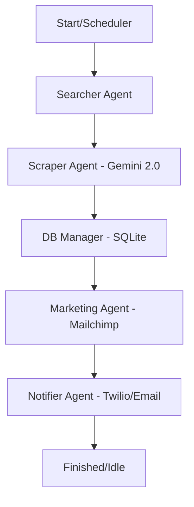

# Technical Analysis: Event Prospecting Multi-Agent System

This project is an automated platform designed to discover events and extract potential leads using advanced artificial intelligence and orchestrated workflows.

## System Architecture

The core of the system is built on **LangGraph**, which orchestrates a cyclic workflow (pipeline) composed of several specialized agents.

### 1. The Agent Pipeline (`graph.py`)
The flow follows a logical sequence of 5 stages:
- **Searcher**: Uses **Tavily Search** to find relevant events on the web based on configured niches (e.g., Circuses, Festivals, Fairs). It is "Time-Aware," meaning it prioritizes future events.
- **Scraper**: Navigates through the found URLs. It uses **Gemini 2.0 Flash** to analyze page content and extract structured data:
    - Contact names.
    *   Email addresses and phone numbers.
    *   Event dates (discarding events that have already passed).
- **DB Manager**: Validates and saves leads into a **SQLite** database, ensuring no duplicates.
- **Marketing**: Integrates new leads directly with **Mailchimp**, subscribing them to an audience list for automatic campaigns.
- **Notifier**: Sends success alerts to admins via **WhatsApp (Twilio)** or **Email (SMTP)**.

### 2. Key Technologies
- **AI**: Google Gemini 2.0 Flash for unstructured data extraction.
- **Orchestration**: LangGraph for state control and agent logic.
- **Search**: Tavily API for AI-optimized web searches.
- **Interface**: **Gradio** provides a web dashboard (http://localhost:7860) to monitor progress and trigger manual searches.
- **Automation**: **APScheduler** runs the entire process automatically every 6 hours.

## Data Flow

## Highlighted Features
- **Intelligent Date Filtering**: The system recognizes if an event has already occurred and automatically discards the lead to avoid irrelevant spam.
- **Persistence**: Data is saved locally in `leads.db`, allowing for a capture history.
- **Extensibility**: Thanks to the repository pattern and the use of `uv`, it's easy to add new search niches or change the database engine.
